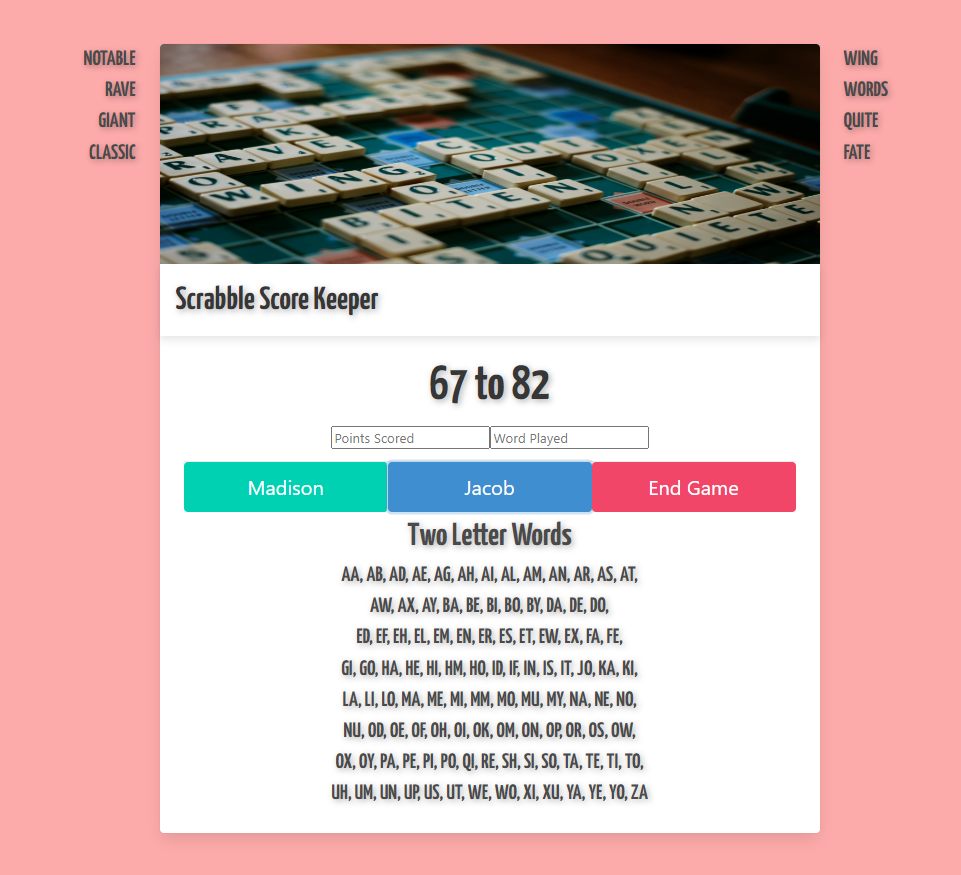

<h1>Scrabble Scorekeeper</h1>

A scorekeeper for playing Scrabble that allows you to track your score and words played for two players. This is a personal project I made for my girlfriend and myself but feel free to update the names in the code to match your needs!.. unless your names just so happen to be Madison and Jacob.

<h2>Features</h2>
<ul>
  <li>Track points scored for two players.</li>
  <li>Tracks words played for two players displayed on the left and right of the container.</li>
  <li>Points scored and words played are not connected in case you would like to only keep track of the score.</li>
  <li>Upon clicking end game you will be redirected to a victory screen for the player with the higher score!</li>
  <li>If you are up for another game you can click the <b>New Game?</b> link to take you back to the scorekeeper.</li>
</ul>

<h2>Usage</h2>
<ol>
  <li>Clone the repository to your local machine.</li>
  <li>Run <code>index.html</code> in browser.</li>
  <li>Enjoy!</li>
</ol>

  

